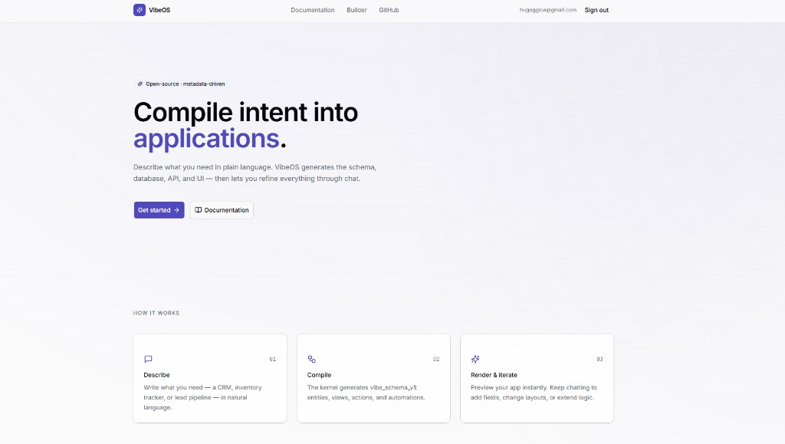
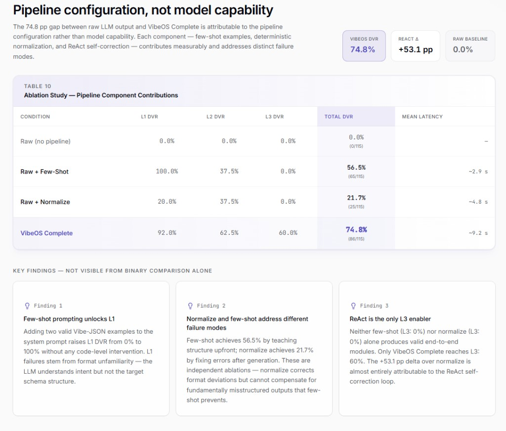

<div align="center">

# VibeOS

### The Open-Source Business Platform for the AI Era

*Describe what you want. Get a working app. Instantly.*

[](https://react.dev)
[](https://vite.dev)
[](https://hono.dev)
[](https://typescriptlang.org)
[](https://postgresql.org)
[](LICENSE)





</div>

> **Academic Context:** This repository is the functional prototype developed as part of the Bachelor Thesis (TFG) *"Developing and Evaluating a Functional Prototype of an Agentic AI Programmer for Enterprise Software"* at La Salle - Universitat Ramon Llull (Barcelona, 2025-2026). It serves as empirical evidence for the research findings presented in the thesis. The comparative claims below (e.g., "10x Faster Than Salesforce") represent the architectural vision of the project and are contextualized with empirical data in the academic document. See the [/tfg](./tfg) directory for the thesis.

---

## Why VibeOS is 10x Faster Than Salesforce

| | **Salesforce** | **VibeOS** |
|---|---|---|
| **Define a data model** | Click through Setup → Object Manager → Create fields one by one | *"Create a CRM with contacts, deals, and pipelines"* → Done |
| **Build a UI** | Lightning App Builder, drag-and-drop, page layouts, record types | Schema defines the UI — Server-Driven rendering handles it |
| **Create an API** | Apex classes, triggers, REST endpoints, SOQL queries | One intent-based endpoint that understands what you need |
| **Add a feature** | Weeks of admin + developer work, sandbox testing, deployment | Describe the feature → AI generates the schema → Live in seconds |
| **Time to first app** | Days to weeks | **Minutes** |
| **Vendor lock-in** | Complete (Salesforce ecosystem) | **Zero** (open-source, self-hosted) |
| **Cost** | $25-300/user/month | **Free forever** |

### The Core Insight

Traditional platforms make you describe your business logic in *their language* — clicks, configurations, proprietary code. VibeOS flips this: **you describe what you want in your language**, and the platform compiles your intent into a running application.

This is the **Vibe Coding** paradigm: metadata as the universal interface between human intent and software.

---

## Architecture

```
Intent (Natural Language)
        │
        ▼
┌─────────────────┐
│  Schema Generator │  ← Vercel AI SDK + Claude Haiku 4.5
│  (LLM Compiler)  │     + Recursive Self-Correction (≤3 attempts)
└────────┬────────┘
         │ vibe_schema_v1
         ▼
┌─────────────────┐
│    Validator     │  ← Zod (Deterministic Compiler Shell)
│  (Safety Net)    │     errors fed back to LLM on retry
└────────┬────────┘
         │ Validated Schema
         ▼
┌─────────────────┐     ┌──────────────────────────┐
│   Vibe Parser   │────▶│  PostgreSQL JSONB Store   │
│ (Runtime Compiler)│    │  vibe_modules · vibe_records │
└────────┬────────┘     └──────────────────────────┘
         │ RuntimeModule
         ▼
┌─────────────────┐     ┌──────────────────┐
│ Action Executor │────▶│  Provider System  │
│ (Engine)        │     │  Email · Webhook  │
└────────┬────────┘     │  Slack · Custom   │
         │              └──────────────────┘
         ▼
┌─────────────────┐
│  Automation     │  ← Event-driven rules
│  Engine         │    trigger → condition → action
└────────┬────────┘
         │
         ▼
┌─────────────────┐
│  SDUI Renderer  │  ← Server-Driven UI Engine
│ (Component Factory)│
└────────┬────────┘
         │ React Components
         ▼
    Rendered App
```

---

## Tech Stack

- **Frontend:** React 19 + Vite 6 + React Router
- **Backend:** Hono (runs on Node.js, Bun, Cloudflare Workers, Vercel)
- **Language:** TypeScript (strict mode, no `any`)
- **Database:** PostgreSQL with JSONB for dynamic entities (works with **Supabase**)
- **ORM:** Drizzle ORM
- **AI:** Vercel AI SDK — **OpenRouter** (default: `google/gemini-2.0-flash-001`) or Anthropic direct; set `OPENROUTER_API_KEY` or `ANTHROPIC_API_KEY` in `.env.local`
- **Validation:** Zod (`vibe_schema_v1` in `src/shared/schemas/`)
- **Providers:** Email (Resend), Webhook (HTTP), Slack
- **UI:** Shadcn/UI + Tailwind CSS v4
- **Design:** Dark-mode first, Linear.app aesthetic

---

## Project Structure

```
vibeoss/
├── index.html                  # Vite entry (`/src/client/main.tsx`)
├── vite.config.ts              # Vite + React + Tailwind (aliases: @ → client, @shared; `/api` → proxy :3001)
├── drizzle.config.ts           # Drizzle Kit (loads `.env.local`; schema under `src/server/database/`)
├── src/
│   ├── client/                 # React SPA (Vite)
│   │   ├── main.tsx            # Bootstrap
│   │   ├── App.tsx             # Router + layout
│   │   ├── index.css           # Global styles
│   │   ├── pages/              # Home, Builder, auth…
│   │   ├── components/         # UI + vibe-ui (SDUI)
│   │   └── lib/                # Client helpers (e.g. auth context)
│   ├── server/                 # Hono API + kernel + engine (Node)
│   │   ├── index.ts            # HTTP server + CORS + routes
│   │   ├── lib.ts              # Barrel re-exports for consumers
│   │   ├── api/vibe.ts         # Intent handler (generate, validate, …)
│   │   ├── kernel/             # Parser, schema generator, self-correction, record validator
│   │   ├── engine/             # Actions + automations
│   │   ├── providers/          # Email, Slack, webhook…
│   │   └── database/           # Drizzle, vibe-storage, migrations (Postgres / Supabase)
│   └── shared/                 # Types + Zod schemas (client + server)
├── scripts/
│   ├── run-benchmark.ts        # VEEF thesis benchmark (T1–T5 × 10 reps)
│   └── benchmark-prompts.json
├── docs/
│   ├── architecture/
│   │   ├── metadata-spec.yaml
│   │   └── system-flow.mermaid
│   └── examples/
│       └── crm-vibe-schema-v1.json
├── tfg/                        # Academic thesis
└── README.md
```

---

## Quick Start

```bash
# Clone the repository
git clone https://github.com/Hugongra/VibeOSS.git
cd VibeOSS

# Install dependencies
npm install

# Set up environment variables
cp .env.example .env.local
# Edit .env.local — at minimum for local dev:
#   ANTHROPIC_API_KEY → required for POST /api/vibe intent "generate"
#   DATABASE_URL     → Postgres connection string (Supabase: Project Settings → Database → URI)

# Run database migrations
npm run db:migrate

# Start everything (frontend + API server — recommended)
npm run dev:all
```

Open the URL Vite prints (usually [http://127.0.0.1:5173](http://127.0.0.1:5173)), sign in with any email (mock auth), go to **Builder**, and describe your app (e.g. *"build a CRM"*).

### What you need locally

| Requirement | Required for |
|---|---|
| **Node 20.6+** (22 LTS recommended) | Vite, Hono, `--env-file` |
| **`ANTHROPIC_API_KEY`** | `intent: generate` (LLM schema generation) |
| **`DATABASE_URL`** + `npm run db:migrate` | Persisting modules & records (PostgreSQL / Supabase) |

**Without Postgres:** generation can still return a schema, but persistence fails (HTTP 500) and the Builder preview runs in **in-memory** mode.  
**Without the API server:** the frontend loads but `/api/vibe` calls fail — run **`npm run dev:all`** or both `npm run dev` and `npm run dev:server`.

### Environment variables (`.env.local`)

| Variable | Required | Description |
|---|---|---|
| `ANTHROPIC_API_KEY` | Yes (for generate) | Anthropic API key |
| `DATABASE_URL` | Yes (for persist) | PostgreSQL URI (Supabase: Project Settings → Database) |
| `PORT` | No | API port (default **3001**) |
| `SCHEMA_GENERATOR_MAX_RETRIES` | No | Self-correction attempts after Zod rejection (default **3**) |
| `VIBEOS_DEFAULT_ORG_ID` | No | Fixed org UUID; otherwise a `"default"` org is created |

See [`.env.example`](.env.example) for optional provider keys (Resend, Slack, Supabase client).

### API intents (`POST /api/vibe`)

| Intent | Status | Description |
|--------|--------|-------------|
| `generate` | ✅ | NL → `vibe_schema_v1` via Claude; Zod validation; **Recursive Self-Correction** (up to 3 attempts); persists to `vibe_modules`; returns `moduleId` + `metadata` |
| `validate` | ✅ | Zod validation of a schema object |
| `query` | ✅ | Read records from `vibe_records` (JSONB filters, pagination) |
| `mutate` | ✅ | Create / update / soft-delete records; validates payload against entity schema |

Other routes: `POST /api/vibe/execute`, `POST /api/vibe/automate`, `GET /api/vibe/providers` (see `src/server/index.ts`).

#### `generate` response metadata

```json
{
  "success": true,
  "schema": { "...": "..." },
  "moduleId": "uuid",
  "metadata": {
    "attemptsUsed": 2,
    "selfCorrected": true,
    "attemptTimingsMs": [12000, 8500]
  }
}
```

#### `mutate` payload example

```json
{
  "intent": "mutate",
  "payload": {
    "moduleId": "<uuid from generate>",
    "entity": "contact",
    "operation": "create",
    "data": { "name": "Alice", "email": "alice@example.com" }
  }
}
```

#### `query` payload example

```json
{
  "intent": "query",
  "payload": {
    "moduleId": "<uuid>",
    "entity": "contact",
    "filter": { "name": "Alice" },
    "limit": 50,
    "offset": 0
  }
}
```

### Ports and duplicate processes

- **API** listens on **`PORT`** (default **3001**). Only one `dev:server` instance per port; the server handles graceful shutdown on restart (`node --watch`).
- **Vite** defaults to **5173**. If that port is busy, Vite picks the next free port (for example **5174**) and prints the URL in the terminal.
- **CORS** for the API allows `http://127.0.0.1:5173` and `5174` (see `src/server/index.ts`). If Vite uses another port, add it there or use the default ports by stopping duplicate `npm run dev` processes.

| Service | URL |
|---|---|
| Frontend (Vite) | [http://127.0.0.1:5173](http://127.0.0.1:5173) (or the URL Vite prints if 5173 is in use) |
| API Server (Hono) | [http://localhost:3001/api/vibe](http://localhost:3001/api/vibe) |

Or start them separately: `npm run dev` (frontend) and `npm run dev:server` (API). **Both must be running** for the Builder to work.

### Builder & interactive preview

- **`/builder`** — chat + live SDUI preview (table, form, detail views from generated schema).
- After a successful **generate**, the preview badge shows **PostgreSQL** when `moduleId` is returned; CRUD uses `query` / `mutate` against `vibe_records`.
- Without DB persistence, preview falls back to **in-memory** mode (data lost on reload).
- **Auth:** mock login only (`localStorage`); any email/password works. The API has no auth middleware yet.

### Smoke tests

**Generate** (requires `ANTHROPIC_API_KEY`):

```bash
curl -s -X POST http://localhost:3001/api/vibe \
  -H "Content-Type: application/json" \
  -d '{"intent":"generate","payload":{"prompt":"A tiny CRM with contacts and deals"}}'
```

Expect `success: true`, `schema`, `moduleId`, and `metadata.attemptsUsed`. On failure after 3 self-correction attempts: HTTP **422** with `metadata.validationErrors`.

**Create a record** (use `moduleId` and entity names from the schema above):

```bash
curl -s -X POST http://localhost:3001/api/vibe \
  -H "Content-Type: application/json" \
  -d '{"intent":"mutate","payload":{"moduleId":"<uuid>","entity":"contact","operation":"create","data":{"name":"Alice","email":"alice@example.com"}}}'
```

**Query records:**

```bash
curl -s -X POST http://localhost:3001/api/vibe \
  -H "Content-Type: application/json" \
  -d '{"intent":"query","payload":{"moduleId":"<uuid>","entity":"contact"}}'
```

### Recursive Self-Correction (§5.3.1)

When Zod rejects LLM output, the kernel feeds **semantic error hints** (not raw paths) back to Claude and retries up to **`SCHEMA_GENERATOR_MAX_RETRIES`** (default 3). Server logs:

```
[Self-correction] Attempt 2/3 — previous error: In entity 'Lead', field 'Revenue': type 'CurrencyString' is not valid...
```

Implementation: `src/server/kernel/schema-generator.ts` (`generateSchemaWithRetry`, `formatZodErrorForLLM`, `buildMessages`). Unit tests: `src/server/kernel/__tests__/self-correction.test.ts`.

### VEEF — telemetry and benchmark (I2IL / DVR harness)

For each `intent: "generate"` request, the API logs **`[VEEF Telemetry]`**:

- **`t_gen`**: LLM generation duration (includes self-correction retries)
- **`t_val`**: Zod `safeParse` duration
- **`t_dep`**: PostgreSQL persist duration (`vibe_modules` insert)
- **`self_correction_attempts`**: e.g. `2 (self-corrected)`

**Thesis benchmark** (5 prompts T1–T5 × 10 repetitions → `results/benchmark-results.json`):

```bash
npm run benchmark
```

Records per run: `attempts_used`, `self_corrected`, `attempt_timings_ms`, HTTP status, latency. Env: `BENCHMARK_BASE_URL`, `BENCHMARK_REQUEST_TIMEOUT_MS`, `SCHEMA_GENERATOR_MAX_RETRIES`.

**Quick VEEF sweep** (alternate prompts, Markdown table output):

```bash
npm run benchmark:veef
```

**Unit tests** (no API keys required):

```bash
npm run test
```

---

## The Vibe-JSON Standard

Every application in VibeOS is defined by a single `vibe_schema_v1` document — entities, views, actions, and automations all in one:

```json
{
  "version": "1.0.0",
  "module": "simple-crm",
  "description": "CRM with contacts and automated welcome emails",
  "entities": [{ "name": "contact", "label": "Contact", "..." : "..." }],
  "views": [
    { "name": "contacts-table", "entity": "contact",
      "layout": { "type": "table", "columns": ["full_name", "email", "status"] } }
  ],
  "actions": [
    { "name": "create-contact", "type": "create", "label": "New Contact", "targetEntity": "contact" },
    { "name": "export-contacts", "type": "export", "label": "Export CSV", "targetEntity": "contact" }
  ],
  "automations": [
    {
      "name": "welcome-email", "entity": "contact", "trigger": "on_create",
      "actions": [{
        "name": "send-welcome", "type": "notify", "label": "Send Welcome",
        "notification": { "channel": "email", "template": "Welcome {{full_name}}!" }
      }]
    }
  ]
}
```

This document describes entities, views, actions, and automations that drive the SDUI renderer and engines. **Persisted CRUD** is available via the `query` / `mutate` API intents against PostgreSQL JSONB (`vibe_records.data`). See [`docs/examples/crm-vibe-schema-v1.json`](docs/examples/crm-vibe-schema-v1.json) for a full example.

---

## VibeOS Enterprise Evaluation Framework (VEEF)

VibeOS includes a measurable evaluation harness for the thesis: **Schema Validity (SV)**, **Database Integrity (DBI)**, **UI Render Consistency (URC)**, and **Constraint Enforcement (CE)**.

The benchmark suite runs tasks **T1–T5** (schema generation, UI mapping, relations, constraints, E2E module) **10 times each** with `temperature: 0` and logs generation, validation, persistence, and self-correction metrics.

### Run the benchmark

```bash
# Terminal 1 — API must be running with ANTHROPIC_API_KEY + DATABASE_URL
npm run dev:server

# Terminal 2
npm run benchmark
```

Results are written to **`results/benchmark-results.json`**. Summary includes **DVR** (2xx rate per task), **self-correction rate**, and mean attempts per task.

```bash
npm run test          # 22 unit tests (Zod, normalization, self-correction mocks)
npm run benchmark:veef  # alternate 5×10 sweep with Markdown table output
```

---

## Star History

[](https://www.star-history.com/#Hugongra/VibeOSS&type=date&legend=top-left)

---

## Contributing

VibeOS is open source and welcomes contributions. See [CONTRIBUTING.md](CONTRIBUTING.md) for guidelines.

---

## License

MIT — Build whatever you want.

---

<div align="center">

**VibeOS** — *Because the best code is the code you never have to write.*

Bachelor Thesis · La Salle-URL · 2025-2026

</div>
